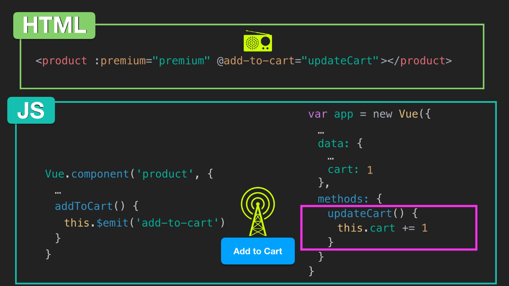

# Vue-exProy1
Vue Example Project 1.

# Notes

## Key attribute

Note that it is recommended to use a special key attribute when rendering elements like this so that Vue can keep track of each node’s identity. We’ll add that in now, using our variant’s unique variantId property.

    

## Methods vs Computed properties

Computed properties are cached, meaning the result is saved until its dependencies change. So when quantity changes, the cache will be cleared and the **next time you access the value of inStock , it will return a fresh result, and cache that result.

With that in mind, it’s more efficient to use a computed property rather than a method for an expensive operation that you don’t want to re-run every time you access it.

It is also important to remember that you should not be mutating your data model from within a computed property. You are merely computing values based on other values. Keep these functions pure.

## Components

* Components are blocks of code, grouped together within a custom element
* Components make applications more manageable by breaking up the whole into reusuable parts that have their own structure and behavior
* Data on a component must be a function
* Props are used to pass data from parent to child
* We can specify requirements for the props a component is receiving
* Props are fed into a component through a custom attribute
* Props can be dynamically bound to the parent’s data
* Vue dev tools provide helpful insight about your components

### Component Hierarchy

* A component can let its parent know that an event has happened with $emit
* A component can use an event handler with the v-on directive ( @ for short) to listen for an event emission, which can trigger a method on the parent
* A component can $emit data along with the announcement that an event has occurred
* A parent can use data emitted from its child

## Forms

We can use the v-model directive to create two-way binding on form elements
We can use the .number modifier to tell Vue to cast that value as a number, but there is a bug with it
We can use the .prevent event modifier to stop the page from reloading when the form is submitted

### Using **.number**

Using the .number modifier on v-model is a helpful feature, but please be aware there is a known bug with it. If the value is blank, it will turn back into a string. [The Vue.js Cookbook](https://vuejs.org/v2/cookbook/form-validation.html#Another-Example-of-Custom-Validation) offers the solution to wrap that data in the Number method, like so:

    Number(this.myNumber)
